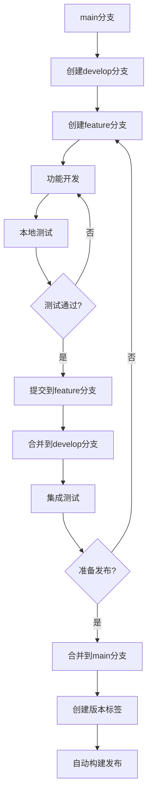

# BadgePatternTool 分支管理规范

## 📋 概述

本文档详细说明了BadgePatternTool项目的Git分支管理策略、开发流程和版本发布规范。所有开发者必须严格遵循此规范，确保代码质量和项目稳定性。

## 🌳 分支结构

### 主要分支

```
main (主分支)
├── develop (开发分支)
├── feature/* (功能分支)
├── hotfix/* (热修复分支)
└── release/* (发布分支)
```

#### 1. `main` 分支
- **用途**: 生产环境代码，始终保持稳定可发布状态
- **保护**: 受保护分支，禁止直接推送
- **合并**: 只能通过PR从develop或hotfix分支合并
- **标签**: 所有版本标签都在此分支创建

#### 2. `develop` 分支
- **用途**: 开发主分支，集成所有新功能
- **来源**: 从main分支创建
- **合并**: 接受feature分支的合并
- **状态**: 应始终保持可构建状态

#### 3. `feature/*` 分支
- **用途**: 新功能开发
- **命名**: `feature/功能描述` (如: `feature/print-dialog-theme`)
- **来源**: 从develop分支创建
- **合并**: 完成后合并回develop分支

#### 4. `hotfix/*` 分支
- **用途**: 紧急修复生产环境问题
- **命名**: `hotfix/问题描述` (如: `hotfix/print-crash-fix`)
- **来源**: 从main分支创建
- **合并**: 同时合并到main和develop分支

## 🔄 开发流程

### 标准开发流程



### 详细步骤

#### 1. 功能开发流程

```bash
# 1. 切换到develop分支并更新
git checkout develop
git pull origin develop

# 2. 创建功能分支
git checkout -b feature/your-feature-name

# 3. 开发功能
# ... 编写代码 ...

# 4. 本地质量检查 (必须执行!)
python scripts/code_quality_check.py

# 5. 本地构建测试 (如果修改了构建相关代码)
python scripts/build.py

# 6. 提交代码
git add .
git commit -m "feat(scope): 功能描述"

# 7. 推送功能分支
git push origin feature/your-feature-name

# 8. 合并到develop分支
git checkout develop
git merge feature/your-feature-name --no-ff
git push origin develop

# 9. 删除功能分支
git branch -d feature/your-feature-name
git push origin --delete feature/your-feature-name
```

#### 2. 版本发布流程

```bash
# 1. 确保develop分支稳定
git checkout develop
git pull origin develop

# 2. 运行完整测试
python scripts/code_quality_check.py
python scripts/build.py

# 3. 更新版本号
# 编辑 src/common/constants.py 中的 APP_VERSION

# 4. 更新CHANGELOG.md
# 添加新版本的更新内容

# 5. 提交版本更新
git add .
git commit -m "chore: 升级版本至 vX.X.X"
git push origin develop

# 6. 等待项目负责人确认并合并到main分支
# (开发者不能直接合并到main分支)
```

## ✅ 提交前检查清单

### 必须执行的检查

每次提交前，开发者**必须**执行以下检查：

```bash
# 1. 代码质量检查 (必须通过)
python scripts/code_quality_check.py
# 预期输出: "Total issues found: 0"

# 2. 构建测试 (如果修改了构建相关代码)
python scripts/build.py
# 预期输出: "Build completed successfully!"

# 3. 基本功能测试
python src/main.py
# 手动验证修改的功能正常工作
```

### 检查项目

- [ ] 代码质量检查通过 (0个问题)
- [ ] 没有语法错误
- [ ] 没有重复导入
- [ ] 构建成功 (如适用)
- [ ] 功能测试通过
- [ ] 提交信息符合规范

## 📝 提交信息规范

### 提交信息格式

```
<type>(<scope>): <description>

[optional body]

[optional footer]
```

### 类型 (type)

- `feat`: 新功能
- `fix`: 修复bug
- `docs`: 文档更新
- `style`: 代码格式调整 (不影响功能)
- `refactor`: 代码重构
- `test`: 测试相关
- `chore`: 构建/工具相关
- `perf`: 性能优化

### 范围 (scope)

- `ui`: 用户界面
- `core`: 核心业务逻辑
- `build`: 构建系统
- `ci`: CI/CD配置
- `docs`: 文档
- `quality`: 代码质量

### 示例

```bash
# 好的提交信息
git commit -m "feat(ui): 添加打印窗口主题适配功能"
git commit -m "fix(core): 修复图片裁剪时的内存泄漏问题"
git commit -m "docs: 更新API文档和使用指南"

# 不好的提交信息
git commit -m "修改了一些东西"
git commit -m "bug fix"
git commit -m "update"
```

## 🚀 版本发布规范

### 版本号规则

采用语义化版本号: `MAJOR.MINOR.PATCH`

- **MAJOR**: 不兼容的API修改
- **MINOR**: 向后兼容的功能性新增
- **PATCH**: 向后兼容的问题修正

### 发布流程

1. **开发完成**: 所有功能在develop分支完成开发和测试
2. **质量检查**: 执行完整的代码质量检查和构建测试
3. **版本更新**: 更新版本号和CHANGELOG.md
4. **提交develop**: 将版本更新提交到develop分支
5. **等待确认**: 项目负责人确认功能稳定性
6. **合并main**: 项目负责人合并develop到main分支
7. **创建标签**: 在main分支创建版本标签
8. **自动构建**: GitHub Actions自动构建和发布

### 发布检查清单

- [ ] 所有功能开发完成
- [ ] 代码质量检查通过
- [ ] 构建测试成功
- [ ] 版本号已更新
- [ ] CHANGELOG.md已更新
- [ ] 功能测试通过
- [ ] 项目负责人已确认

## 🛡️ 分支保护规则

### main分支保护

- 禁止直接推送
- 需要PR审核
- 需要状态检查通过
- 需要管理员权限合并

### develop分支规则

- 允许直接推送 (仅限开发者)
- 推送前必须通过本地检查
- 保持构建状态稳定

## 🚨 紧急修复流程

### Hotfix流程

```bash
# 1. 从main分支创建hotfix分支
git checkout main
git pull origin main
git checkout -b hotfix/urgent-fix-description

# 2. 修复问题
# ... 编写修复代码 ...

# 3. 本地测试
python scripts/code_quality_check.py
python scripts/build.py

# 4. 提交修复
git add .
git commit -m "fix: 紧急修复描述"
git push origin hotfix/urgent-fix-description

# 5. 合并到main和develop (需要管理员权限)
# 项目负责人执行合并操作
```

## 📚 最佳实践

### 开发建议

1. **小步提交**: 每个提交只包含一个逻辑变更
2. **描述清晰**: 提交信息要清楚说明做了什么
3. **本地测试**: 提交前必须在本地验证
4. **及时同步**: 定期从develop分支拉取最新代码
5. **分支清理**: 及时删除已合并的功能分支

### 避免的问题

- ❌ 直接在main分支开发
- ❌ 跳过代码质量检查
- ❌ 提交未测试的代码
- ❌ 使用模糊的提交信息
- ❌ 长期不合并的功能分支

## 🔗 相关工具

### 开发工具

```bash
# 代码质量检查
python scripts/code_quality_check.py

# 构建工具
python scripts/build.py

# 开发工具集
python scripts/dev_tools.py run|test|quality|build
```

### Git别名配置

```bash
# 推荐的Git别名
git config --global alias.co checkout
git config --global alias.br branch
git config --global alias.ci commit
git config --global alias.st status
git config --global alias.unstage 'reset HEAD --'
git config --global alias.last 'log -1 HEAD'
git config --global alias.visual '!gitk'
```

## 🎯 权限管理

### 角色定义

#### 项目负责人 (Maintainer)
- **权限**: 完全访问权限
- **职责**:
  - 审核和合并PR到main分支
  - 创建和管理版本标签
  - 管理分支保护规则
  - 决定版本发布时机

#### 开发者 (Developer)
- **权限**: develop分支推送权限
- **职责**:
  - 在develop分支进行日常开发
  - 执行本地质量检查
  - 遵循提交规范
  - 等待负责人确认后才能发布版本

### 权限限制

- ❌ 开发者**不能**直接推送到main分支
- ❌ 开发者**不能**创建或删除版本标签
- ❌ 开发者**不能**修改分支保护规则
- ✅ 开发者**可以**在develop分支自由开发
- ✅ 开发者**可以**创建和管理功能分支

## 🔍 代码审查流程

### PR审查要求

当需要合并到main分支时：

1. **创建Pull Request**
   - 从develop分支到main分支
   - 填写详细的PR描述
   - 列出主要变更内容

2. **自动检查**
   - GitHub Actions自动运行质量检查
   - 构建测试必须通过
   - 所有状态检查必须为绿色

3. **人工审查**
   - 项目负责人审查代码变更
   - 确认功能完整性和稳定性
   - 验证版本号和CHANGELOG更新

4. **合并条件**
   - 所有自动检查通过
   - 负责人审查通过
   - 没有合并冲突

## 📊 版本管理策略

### 版本规划

#### 主版本 (Major)
- 重大架构变更
- 不兼容的API修改
- 用户界面重大改版
- 示例: 1.0.0 → 2.0.0

#### 次版本 (Minor)
- 新功能添加
- 向后兼容的改进
- 性能优化
- 示例: 1.5.0 → 1.6.0

#### 修订版本 (Patch)
- Bug修复
- 小的改进
- 安全补丁
- 示例: 1.5.5 → 1.5.6

### 版本发布周期

- **主版本**: 根据需要，通常6-12个月
- **次版本**: 每月1-2次，根据功能完成情况
- **修订版本**: 根据需要，紧急修复随时发布

## 🚨 应急处理流程

### 紧急修复场景

1. **生产环境严重Bug**
2. **安全漏洞**
3. **数据丢失风险**
4. **用户无法正常使用**

### 应急响应步骤

```bash
# 1. 立即评估影响范围
# 2. 创建紧急修复分支
git checkout main
git checkout -b hotfix/emergency-fix-YYYYMMDD

# 3. 快速修复 (最小化变更)
# ... 只修复关键问题 ...

# 4. 紧急测试
python scripts/code_quality_check.py
# 快速功能验证

# 5. 立即发布
# 项目负责人直接合并到main分支
# 创建紧急版本标签 (如 v1.5.6-hotfix.1)
```

### 事后处理

1. **回合develop分支**: 确保修复也应用到开发分支
2. **问题分析**: 分析问题根因，防止再次发生
3. **流程改进**: 更新测试和检查流程
4. **文档更新**: 更新相关文档和说明

## 📋 检查清单模板

### 功能开发检查清单

```markdown
## 开发完成检查

- [ ] 功能需求已完全实现
- [ ] 代码质量检查通过 (`python scripts/code_quality_check.py`)
- [ ] 构建测试成功 (`python scripts/build.py`)
- [ ] 手动功能测试通过
- [ ] 没有引入新的警告或错误
- [ ] 代码注释完整清晰
- [ ] 提交信息符合规范

## 合并前检查

- [ ] develop分支已是最新版本
- [ ] 没有合并冲突
- [ ] 所有相关测试通过
- [ ] 功能分支已推送到远程
- [ ] 准备删除功能分支
```

### 版本发布检查清单

```markdown
## 版本发布检查

- [ ] 所有计划功能已完成
- [ ] 代码质量检查通过 (0个问题)
- [ ] 构建测试成功
- [ ] 版本号已正确更新
- [ ] CHANGELOG.md已更新
- [ ] 所有功能手动测试通过
- [ ] 没有已知的严重Bug
- [ ] develop分支状态稳定

## 发布后验证

- [ ] GitHub Actions构建成功
- [ ] Release文件正确生成
- [ ] 下载链接可用
- [ ] 版本标签已创建
- [ ] 用户可以正常下载和使用
```

## 🛠️ 故障排除

### 常见问题

#### 1. 代码质量检查失败
```bash
# 查看具体错误
python scripts/code_quality_check.py

# 常见问题:
# - 重复导入: 删除重复的import语句
# - 语法错误: 检查Python语法
# - 缺少文档字符串: 添加必要的docstring
```

#### 2. 构建失败
```bash
# 检查构建日志
python scripts/build.py

# 常见问题:
# - 依赖缺失: pip install -r requirements.txt
# - 路径错误: 检查文件路径是否正确
# - 权限问题: 确保有写入权限
```

#### 3. 合并冲突
```bash
# 解决冲突
git checkout develop
git pull origin develop
git checkout your-feature-branch
git rebase develop

# 手动解决冲突后
git add .
git rebase --continue
```

#### 4. 版本标签问题
```bash
# 删除错误的标签
git tag -d v1.5.6
git push origin :refs/tags/v1.5.6

# 重新创建标签
git tag v1.5.6
git push origin v1.5.6
```

---

## 📞 联系方式

- **项目负责人**: [在此填写联系方式]
- **技术支持**: [在此填写技术支持联系方式]
- **问题反馈**: https://github.com/fenglyu1314/BadgePatternTool/issues

---

**重要提醒**: 严格遵循此规范是确保项目质量和团队协作效率的关键。如有疑问，请及时与项目负责人沟通。

**文档版本**: v1.0
**最后更新**: 2025-06-20
**适用版本**: BadgePatternTool v1.5.6+
